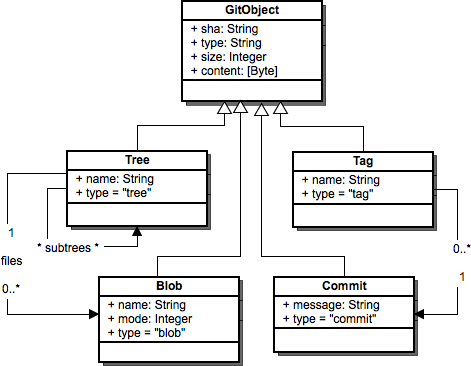

# Leni Version Control System

    
      
    
    
  

Leni terminal is Version Control System, very much a clone of git in python.
Nevertheless it is provided a few added controls to manage files independently of the terminal shell

# pending features for v1.0.0 release

- [x] "python leni.py init" command creates and saves whole initial state, partial development currently
- [ ] dynamic switching between different refs|branches (hand in hand with showing history Tree with hashes available)
- [ ] executable "leni.exe" for CLI usage.
- [ ] alternative pip package setup.py file

# Simple Commands

Leni is planned to only support the following commands

**Command**|**Description**
:-----:|:-----:
**\<blank space \>**| Display Leni Manual, list of commands and information
**init**| Creates ./leni file containing database and scripts
**status**| shows relevant data of current branch
**commit**| states the changes of the project
**log**| shows 
**branch**| shows relevant data of current branch
**merge**| shows relevant data of current branch

# Folder <code>/.leni </code> structure

    ./project
        |
        ├── release             --> release version and requirements
        ├── requirements.txt    --> release version and requirements
        ├── structure.txt       --> structure of the ./.leni/ file system
        ├── .temp               --> saves temporary data
        ├── .env                --> saves environmental variables if used (not in this version)
        ├── changelog.txt       --> erros and warning specifications
        ├── readme.md
        ├── static              --> Contains visual representations of current Tree
        │   ├── fonts
        │   ├── images
        │   ├── javascript
        │   └── styles
        └── builtin             --> Classes and static methods with specific and general use

    ./.leni
        ├── HEAD                            --> pointer (ref: refs/heads/<current branch>)
        ├── COMMIT_EDITMSG                  --> commit description of inmediate last 
        ├── config
        ├── index
        ├── objects/
        ├── refs/
        |       |
        |       └── heads/main              --> saves up latest hash for certain branch
        └── logs/
                |
                └── refs/
                        |
                        ├── heads/
                        └── HEAD

# Database Design is going to be inspired by Git

**Command**|**Description**
:-----:|:-----:
**GitObject**|  display listed commands and their usage
**Tree**| History of consecuent commits
**Blob**| TypeNone-like datatype
**Commit**| Unit of recorded changes in repository

# Resources

- https://www2.fossil-scm.org/home/doc/trunk/www/tech_overview.wiki
- https://aosabook.org/en/v2/git.html
- https://dev.to/wesen/14-great-tips-to-make-amazing-cli-applications-3gp3
- https://ruslanspivak.com/lsbasi-part1/
- https://click.palletsprojects.com/en/8.1.x/
- https://docs.python.org/3/library/argparse.html

## Finds the difference between two files using Levenshtein distance.

- https://github.com/Ach113/dif
- https://clig.dev/
